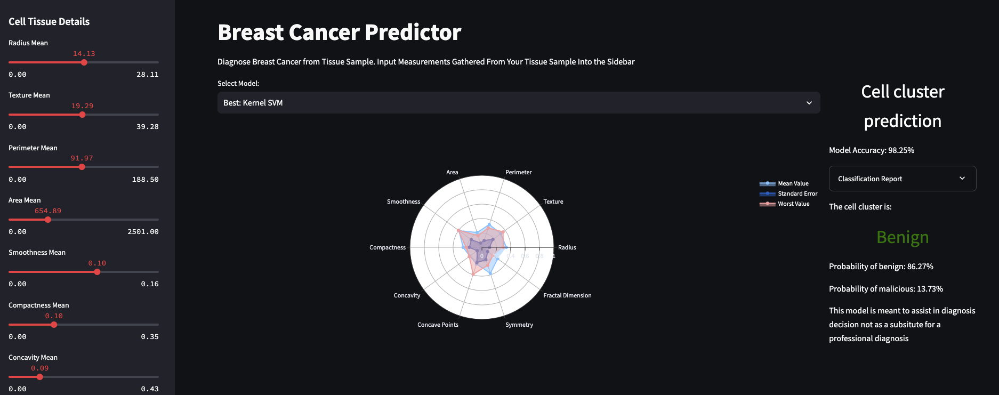

## Check out the project [here](https://cancer-classifier.streamlit.app/)
## Tools Used:
*Developed and implemented an end-to-end Machine Learning app with Multiple Machine Learning Models, XGBoost, Logistic Regression, Random Forest, Kernel SVM, Scikit-learn, Data Cleaning, Normalize Data with Standard Scaler, Encoded Categorical Labels, Evaluate model using accuracy, precision, recall, and F-1, Implement Plotly visualization with a Radar Chart, Interactive Web app using streamlit, User-friendly interface using sliders, Used Select box to load different Machine Learning Models, Leveraged Caching to optimize data loading and model training, Deployed models as user-friendly web app*
## Summary:
- **Engineered a Comprehensive Breast Cancer Prediction Pipeline:**
Designed and implemented multiple machine learning models, including XGBoost, Logistic Regression, Random Forest, and Kernel SVM, to accurately classify breast cancer as benign or malignant.

- **Advanced Data Preprocessing Techniques:**
Cleaned and preprocessed the dataset by removing unnecessary columns, mapping categorical labels to numerical values, and scaling features using StandardScaler to ensure consistent model performance.

- **Model Training and Evaluation:**
Trained and evaluated models using train_test_split to create training and testing datasets, ensuring robust evaluation of model performance.
Calculated and reported performance metrics including accuracy, precision, recall, and F1-score, providing detailed insights into each model's effectiveness.

- **Interactive Web Application Development:**
Developed an interactive web application using Streamlit, allowing users to input tissue sample measurements via sliders and select different machine learning models for prediction.
Created visualizations using Plotly to display radar charts, showcasing feature distributions for better interpretability.

- **Model Deployment and Performance Documentation:**
Deployed models within the Streamlit application, enabling real-time predictions with corresponding probabilities.
Documented model performance and provided detailed classification reports to facilitate informed decision-making.

- **Expertise in Data Handling and Machine Learning Libraries:**
Proficiently managed data manipulation and model training using Python libraries such as Pandas, NumPy, scikit-learn, XGBoost, and Plotly.
Ensured efficient and scalable application development through effective use of Streamlit caching mechanisms.

- **Skilled in Python Programming and Application Integration:**
Demonstrated proficiency in Python programming, integrating various libraries to create a cohesive and functional web application.
Leveraged advanced techniques to optimize application performance and enhance user experience.

