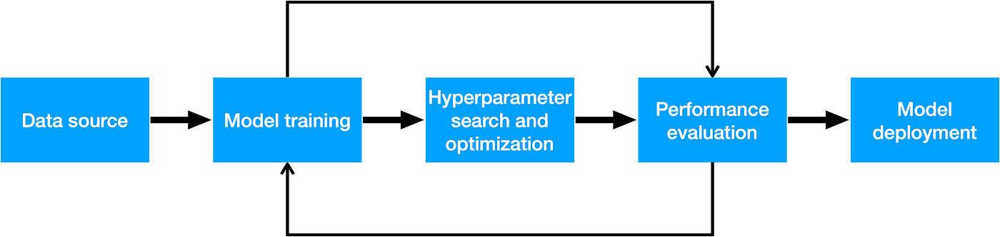

```python
# PLEASE DON'T BE 3
def predict():
  return random.choice(['cat','dog', 'AI OVERLORD'])
print(f'Prediction: {predict()}')
```

{: .align-right width="250px"}
👨🏻‍💻 I’m a dedicated Machine Learning Engineer with a rich and diverse background. My journey began in the world of operations, where I successfully led teams and managed complex data as an Operations Manager. My time as a Sergeant in the Marine Corps further honed my problem-solving abilities, communication skills, and adaptive thinking.

🔬 Driven by a profound belief in AI's potential to revolutionize and enhance humanity, I decided to pivot my career towards Machine Learning. After graduating from LSU's AI/ML bootcamp powered by Fullstack Academy, I deepened my expertise with specialized courses in AI/ML, Google's TensorFlow certification, Computer Vision, Langchain, PyTorch, Git, and Environment-based Reinforcement Learning.

📚 I'm intrigued by interesting Machine Learning use cases like Biology 🧬, Healthcare 🩻, Space 🪐, and Physics 🚀

🥳 When I'm not teaching computers how to take over the world: You can find me restaurant hopping for good food and drinks with my beautiful fiance, screaming at the refs during a 49ers game, reading a sci-fi/fantasy novel, or throwing the frisbee with my dog, "Anakin".

# Skills


## Data Acquisition: 
### Proficient in sourcing and collecting diverse datasets crucial for model training.
**Using**: *SQL queries, API utilization, Web scraping (Beautiful Soup and Requests), Stuctured and Unstructured data (csv, txt, pdf, etc), Build Langchain based AI assistant for additional data exploration.*

## Data Engineering: 
### Skilled in cleaning, transforming, and preparing data for analysis and modeling. Additionally I have a keen eye for extracting meaningful features from existing data to feature engineer additional data insights to enhance model performance.
**Using**: *Pandas, Numpy, Tensorflow, Seaborn, Matplotlib*

## Model Building: 
### Capable of developing robust machine learning models tailored to specific tasks and objectives.
**Using**: *Tensorflow, Pytorch, Sci-kit Learn, Transfer Learning, Huggingface Hub, Implementation from research papers*

## Model Testing and Fine Tuning: 
### Thorough in evaluating model performance and iteratively refining for optimal results. Adept at optimizing model parameters for enhanced accuracy and efficiency.
**Using**: *Gridsearch/random search parameter tuning, Data Augmentation, Upsampling, Learning rate optimization, evaluation of training metrics loss/accuracy using graphs to identify bias.*
